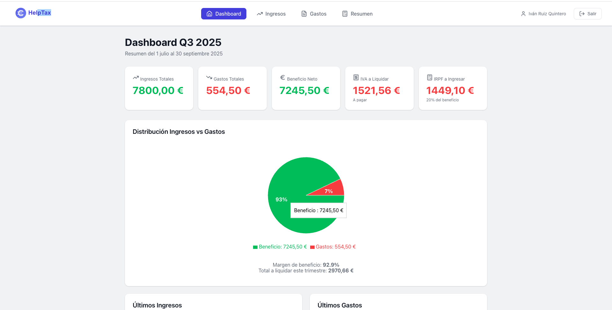
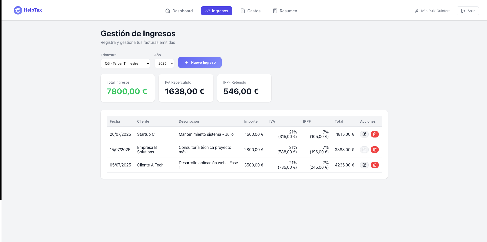
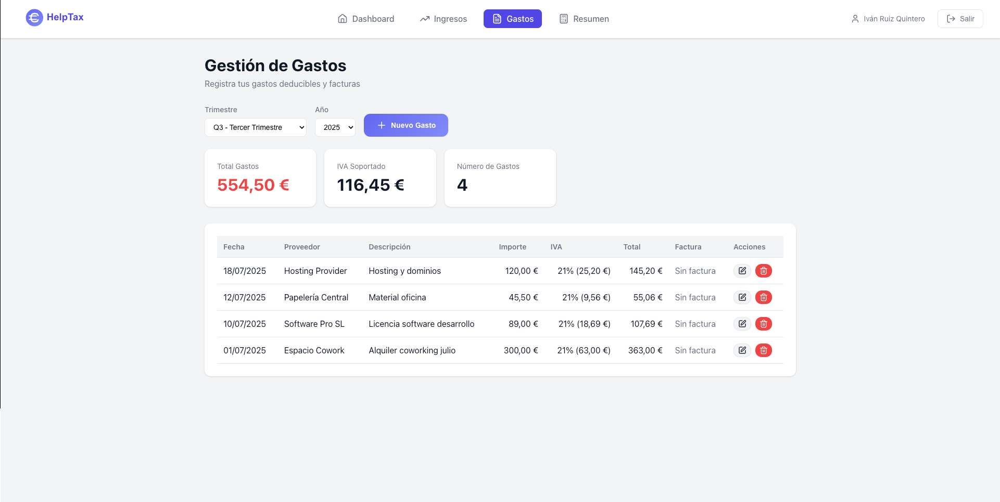
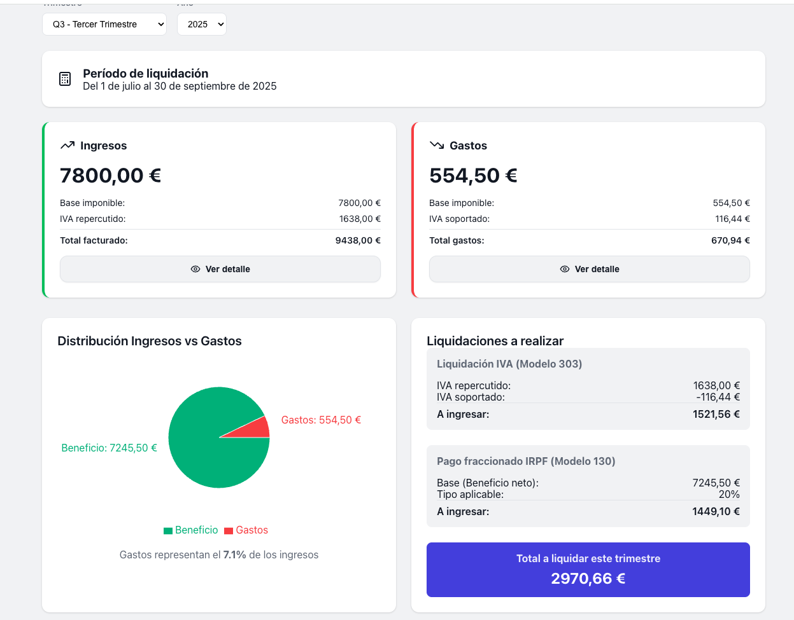
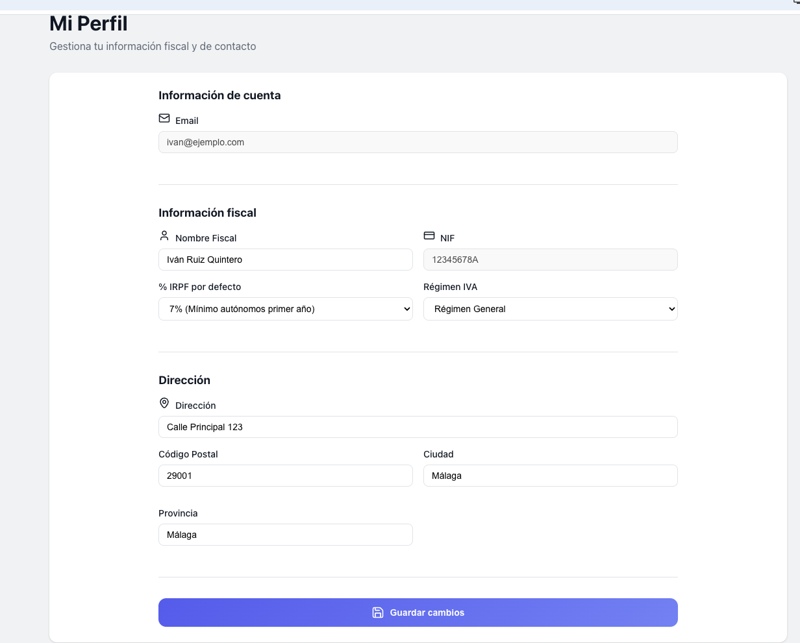

# HelpTax - Sistema de Gestión Fiscal para Autónomos

Sistema completo de gestión fiscal diseñado específicamente para autónomos en España. Permite gestionar ingresos, gastos y calcular automáticamente las liquidaciones trimestrales de IVA e IRPF.

## 🚀 Características principales

- 📊 **Dashboard interactivo** con métricas clave
- 💰 **Gestión de ingresos** con cálculo automático de IVA e IRPF
- 📄 **Control de gastos** deducibles con subida de facturas
- 📈 **Resúmenes trimestrales** automáticos
- 🔐 **Multi-usuario** - Cada autónomo gestiona sus propios datos

## 🛠️ Stack Tecnológico

### Frontend
- React 19 + TypeScript
- React Router DOM v7
- Axios para peticiones HTTP
- Recharts para visualizaciones
- Lucide React para iconos

### Backend  
- Django 5.2 + Django REST Framework
- Autenticación JWT (Simple JWT)
- SQLite (desarrollo) / PostgreSQL (producción)
- Django CORS Headers

## 📋 Requisitos

- Node.js 18+ y npm
- Python 3.10+
- Git

## 🔧 Instalación rápida

### 1. Clonar el repositorio
```bash
git clone https://github.com/tu-usuario/helptax.git
cd helptax
```

### 2. Configurar el Backend
```bash
cd backend
python -m venv venv
source venv/bin/activate  # En Windows: venv\Scripts\activate
pip install -r requirements.txt
python manage.py migrate
python manage.py createsuperuser  # Opcional
python manage.py runserver
```

### 3. Configurar el Frontend (en otra terminal)
```bash
cd frontend
npm install
cp .env.example .env
npm start
```

### 4. Acceder a la aplicación
- Frontend: http://localhost:3000
- Backend API: http://localhost:8000/api/
- Admin Django: http://localhost:8000/admin/

## 📚 Documentación

- [Documentación del Frontend](./frontend/README.md)
- [Documentación del Backend](./backend/README.md)

## 📸 Screenshots

### Dashboard Principal

*Vista general con estadísticas del año actual y movimientos recientes*

### Gestión de Ingresos

*Control completo de facturas emitidas con cálculo automático de IVA e IRPF*

### Control de Gastos

*Registro de gastos deducibles con opción de adjuntar facturas*

### Resumen Trimestral

*Cálculo automático de liquidaciones trimestrales de IVA e IRPF*

### Perfil Fiscal

*Configuración personalizada de datos fiscales y porcentajes de retención*

## 🤝 Contribuir

Las contribuciones son bienvenidas. Por favor:

1. Fork el proyecto
2. Crea tu rama de características (`git checkout -b feature/NuevaCaracteristica`)
3. Commit tus cambios (`git commit -m 'Añadir nueva característica'`)
4. Push a la rama (`git push origin feature/NuevaCaracteristica`)
5. Abre un Pull Request

## 📝 Licencia

Este proyecto está bajo la Licencia MIT - ver el archivo [LICENSE](LICENSE) para más detalles.

## 👨‍💻 Autor

**Iván Ruiz Quintero**

- GitHub: [@tu-usuario](https://github.com/tu-usuario)
- LinkedIn: [Tu perfil](https://linkedin.com/in/tu-perfil)

---

Desarrollado con ❤️ para autónomos por un autónomo